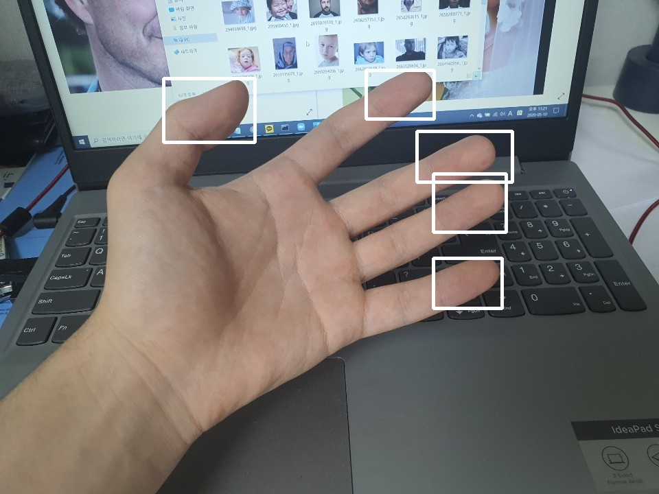
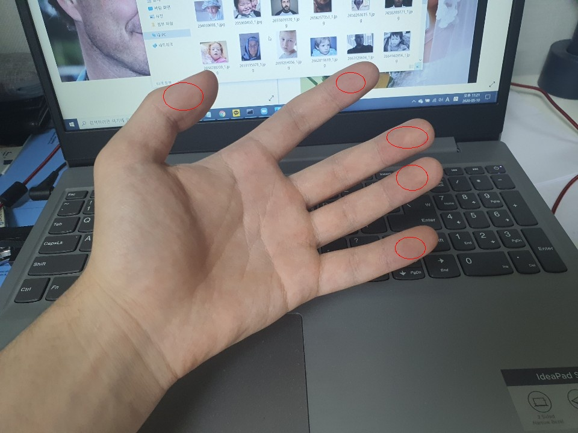
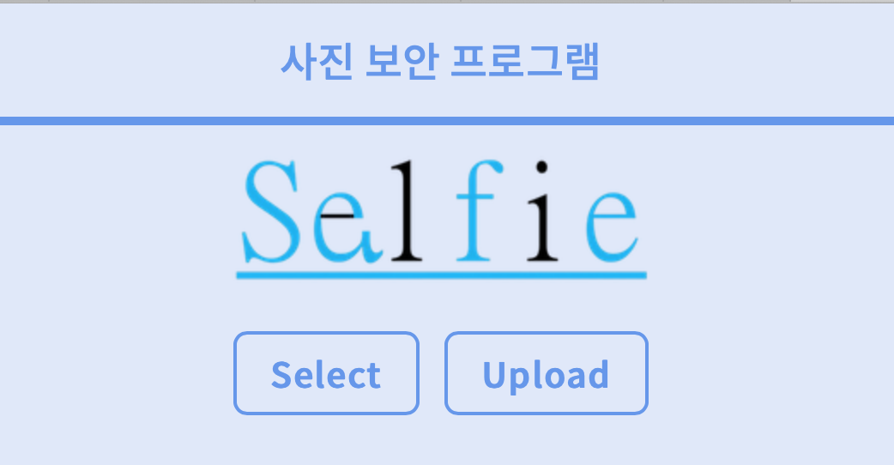

## Intro

<p align="center"> 
 

</p>

## Dependencies

Python3, flask, tensorflow 1.0, numpy, opencv 3.

### Getting started

1. 파이썬3 설치와 함께 관련 라이브러리 모두 설치
    ```
    pip install flask
	pip install tensorflow
	pip install numpy
	pip install opencv
    ```

2. 서비스 동작을 위한 서버 실행
    ```
	python app.py
    ```

3. 서버 접속 (using WEB)
	```
	http://localhost:5000
	```

	

## Weights (가중치)

**Android demo on Tensorflow's** [here](https://github.com/tensorflow/tensorflow/blob/master/tensorflow/examples/android/src/org/tensorflow/demo/TensorFlowYoloDetector.java)

